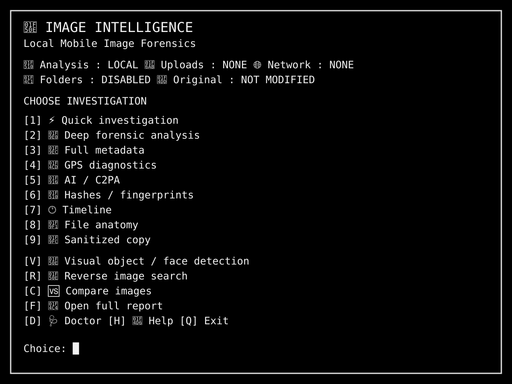

# 🔎 Image Intelligence


[](https://github.com/Tinytim695/Image-analysis-tool/actions/workflows/quality.yml)

**Local-first mobile image forensics for Debian in Termux/proot.**

Image Intelligence analyses **one explicitly selected image at a time** and produces human-readable forensic indicators without modifying the original file.



## ✨ Features

| Area | What it provides |
|---|---|
| 📸 Image intake | Android file picker, one image at a time |
| 🧬 Metadata | EXIF, XMP, IPTC and raw ExifTool output |
| 📍 Location | GPS presence, coordinates and empty-field diagnostics |
| 🤖 AI / provenance | AI-related metadata and C2PA/JUMBF checks |
| 🔐 Fingerprints | MD5, SHA1, SHA256, aHash, dHash and optional pHash |
| 🕐 Timeline | Capture, creation and modification timestamps |
| 🧱 File anatomy | Magic bytes and optional binwalk/zsteg checks |
| 🔗 Artifacts | OCR plus URLs, email addresses and IPv4 extraction |
| 🧪 ELA | JPEG recompression-difference indicator |
| 🧼 Sanitising | Creates a separate metadata-stripped copy |
| 🆚 Comparison | Local comparison of two selected images |
| 🔎 Reverse search | Explicit, user-initiated external search workflow |
| 🩺 Doctor | Dependency and privacy-model checks |

## 🔐 Privacy by design

The normal analysis path is deliberately local-first.

- No whole-folder scanning
- No automatic uploads
- No automatic network requests during analysis
- No automatic URL opening
- One selected image at a time
- Original files are never modified
- Sanitising creates a separate copy
- Reverse-image search requires an explicit user choice

When reverse search is selected, the tool prepares a local copy in shared storage and opens the search site **only after you choose the service**. The script does not upload the image for you.

## 🚀 Installation

Inside Debian or another supported Linux environment:

```bash
git clone https://github.com/Tinytim695/Image-analysis-tool.git
cd Image-analysis-tool
bash install.sh
```

The installer:

1. Checks that it is running as root.
2. Backs up an existing `/usr/local/bin/image`.
3. Installs the `image` command.
4. Runs a Bash syntax check.
5. Prints the available health check and launch commands.

No package installation, upload or network scan is performed by the installer itself.

## ▶️ Usage

Interactive menu:

```bash
image
```

Health check:

```bash
image --doctor
```

Quick / deep / full modes:

```bash
image --quick
image --deep
image --full
```

Latest report:

```bash
image --latest
```

## 🧰 Optional dependencies

The core interface is Bash. Extra forensic capabilities become available when these tools are installed:

`exiftool`, `python3`, Pillow, NumPy, `tesseract`, `binwalk`, `zsteg`, `xxd`, `less` and the Termux API image picker.

The project intentionally does **not** silently install dependencies. Run `image --doctor` to see what is available.

## 🧠 Interpreting results

Image Intelligence reports **indicators**, not absolute verdicts.

Perceptual hashes measure visual similarity, not identity. ELA, entropy, compression differences and file-structure findings are clues that should be interpreted alongside other evidence. C2PA/provenance information is useful provenance evidence, but its presence or absence does not by itself establish whether an image is genuine, manipulated or AI-generated.

No local AI marker does **not** prove an image was created by a person, because metadata can be removed, altered or never written.

## 🧪 Project philosophy

The goal is a practical forensic toolbox that is:

**local-first · transparent · non-destructive · human-reviewed**

It is intended for legitimate image verification, research, investigation and educational use.

## 🔒 Scope boundary

This repository contains **Image Intelligence only**.

The author's separate local Ari/LLM environment is not part of this project and is not distributed here.

## 📄 Licence

MIT. See [LICENSE](LICENSE).

## 👤 Author

GitHub: [@Tinytim695](https://github.com/Tinytim695)
